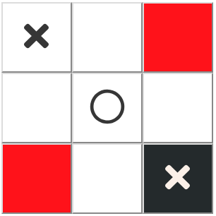

# React Tic Tac Toe

  This project implements the traditional game of [Tic Tac Toe](https://en.wikipedia.org/wiki/Tic-tac-toe). The live version can be seen [here](https://ricardoagra.github.io/react-tic-tac-toe/).

## Component Tree

  The component tree structure can be seen in the following diagram:
  
  

  Where the sharp edge elements are statefull and the round edge elements are stateless.

## State

  State management was implemented with Redux. The state is composed of the following fields:

  * **matchId**: A string of 20 characters used to identify the match.
  * **boardState**: A string array representing the board state for each position. The 9 positions are numbered from 0 to 8.
  * **lastMove**: An object containing "position": the last human move, and "char": the char that represents a human move.
  * **nextAction**: A string that indicates what is the next expected input. It can be "humanSelect" when it waits for the user to select his/her marker, "human" when it expects a human move or "computer" while the AI is thinking. 
  * **moveHistory**: An array of integers that stores both computer and human moves. Example: [0, 4, 3, 2].
  * **victory**: A string that indicates who won the match ("human", "computer", "tie", default: "").

## State Management

  The state is passed down according to the following diagram:

  

  ### Component Rendering and Update

  #### Header.js
  The Header element mainly reads user inputs and has one state dependency, **matchId**. Since this is a primitive, it extends **PureComponent** to manage updates.

  #### Main.js
  This container is responsible for wrapping the board. It consumes all the properties from the store and distributes them through its children. This container always updates when the state changes.

  #### title.js
  This stateless component is responsible for asking the user to select his marker when the user goes first, to tell the user who's turn it is to play, or the result of the match. It subscribes to two properties: **nextAction** and **victory**. To only update with those properties instead of with parent updates, [React.memo](https://reactjs.org/blog/2018/10/23/react-v-16-6.html) was used for shallow property checks.

  #### board.js
  This component represents the board. It receives **boardState** to initialize the component for each square and **lastMove** to show the user's last move. Since one of its dependencies, **boardState**, is not a primitive, it implements the **shouldComponentUpdate** life cycle hook instead of extending **PureComponent**.

  #### square.js

  Stateless. It displays either nothing, a circle or a cross based on it's **content**. It can also be highlighted when his second and last property **isLastMove**, a boolean flag, is set to true. It uses an anonymous arrow function to check property changes and manage updates.

  ## Artificial Inteligence

  **Note:** In order to better understand the examples below, the squares will be referenced with a number from 0 to 8 and a type between "center", "corner" or "border" square, according to the diagram bellow:

  

  In any turn based game, the first move has always the advantage. Even more so in Tic Tac Toe since the total number of moves is very limited. Therefor, the strategy is to attack when going first and defend when going second.

  The best way to attack is to go for a winning shape. A winning shape is a combination of moves that allow for two or more possible ways to win, which guarantees a victory.

  Examples are:
  
  
  

  ### Move 1 - First to move

  **Note:** In the following examples, the computer will always be represented with the symbol **X** and the human with the symbol **O**.

  Playing on any the corners at the start of the game is the best offensive move. It gives your opponent only 2 out of 8 possible moves that won't result in a loss. In the image below, the 4 colors represent the 4 different responses to a move in the corner.

  **Note:** The computer always chooses the corner move #0 for simplicity.

  

  The squares in red, orange and purple are losing moves. The green squares are safe.

  Red loses as follows: [X#0 - O#1/#3 - X#4 - O#8 (forced move) - X#6/#2 (winning shape)]

  
  

  Orange loses as follows: [X#0 - O#2/#6 - X#8 - O#4 (forced move) - X#2/#6 (winning shape)]

  
  

  Purple loses as follows: [X#0 - O#5/#7 - X#2/#6 - O#1/#3 (forced move) - X#4 (winning shape)]

  
  

  ### Move 2

  Either the opponent played in the center or somewhere else. If the move was not in the center, we should play there since the center square allows for more winning combinations while being a safe square against any other start. If the move was in the center, we play in a corner, which is better than playing in a border square.

  ### Move 3

  Since we know the computer played at 0, we only need to check the opponent's move and respond accordingly.
  Based on the strategy explained in move 1, the only two possibilities not yet explored are a center move or a move in the opposite corner. The response to each move is to make the other: [ X#0 - O#4 - X#8], or [X#0 - O#8 - X#4]. The goal is to maximize the chances of making a winning shape, in the case our opponent plays in any of the red squares.

   
   

  ### Move 4+

  From here on out the AI calculates the best move using the following decision tree:

  * **Can I win?** : check if any computer move results in a victory.
  * **Can my opponent win?** : check if any next human move results in a victory.
  * **Can I make a winning shape?** : check if any move allows for at least two possible winning moves.
  * **Can I make an attack move that doesn't allow a winning shape for my opponent?** : check if a move allows a victory next turn without the opponent's response giving him two possibilities to win.
  * **Square priority**: Play in the center. If not possible, play on a corner. Finally, play on a border square.

